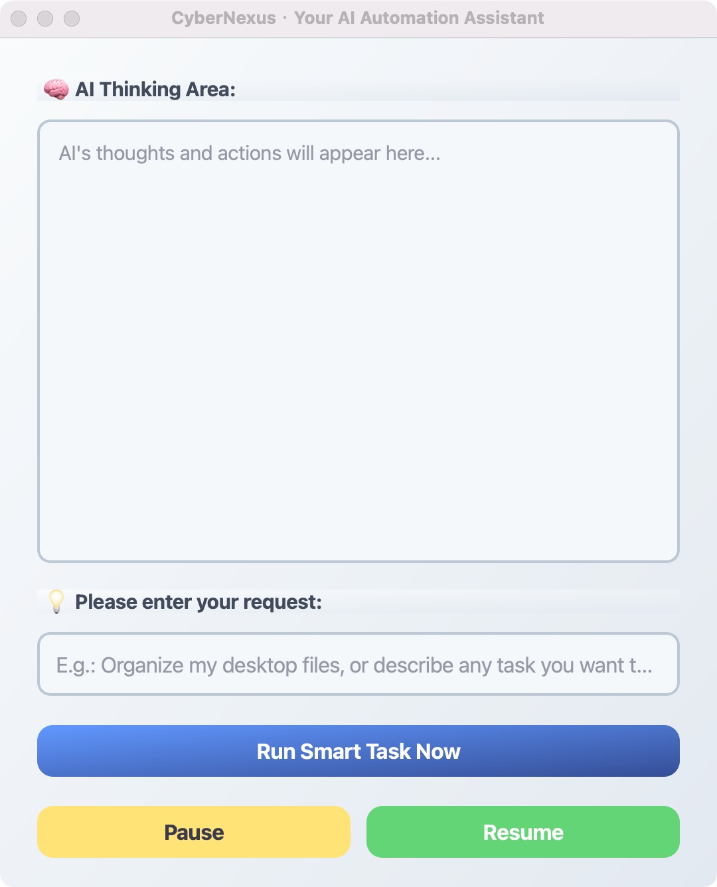

# CyberNexus

> 基于 doubao-1-5-ui-tars-250428 模型，让电脑自动化执行任务
> 
> Personal learning project based on the doubao-1-5-ui-tars-250428 LLM.

## 项目简介 / Project Introduction

通过大语言模型（AI），让电脑能够理解自然语言指令，自动化完成各类操作任务。

This project uses large language models (AI) to enable your computer to understand natural language instructions and automatically complete various tasks.

## 快速开始 / Quick Start

```bash
pip install -r requirements.txt

export ARK_API_KEY=******************

python main.py
```



## 案例 / Examples
<table>
  <thead>
    <tr>
      <th width="50%" align="center">Search Pictures</a></th>
      <th width="50%" align="center">earch Tickets</a></th>
    </tr>
  </thead>
  <tbody>
    <tr>
      <td align="center">
        <video src="https://github.com/user-attachments/assets/84bc6151-c166-458b-b352-98f09a223823" width="50%"></video>
      </td>
      <td align="center">
        <video src="https://github.com/user-attachments/assets/8c5eac14-8654-4503-b25f-b1dc77f58906" width="50%"></video>
      </td>
    </tr>
  </tbody>
</table>

